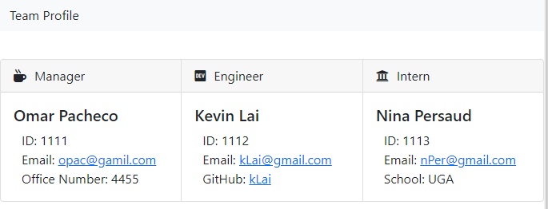
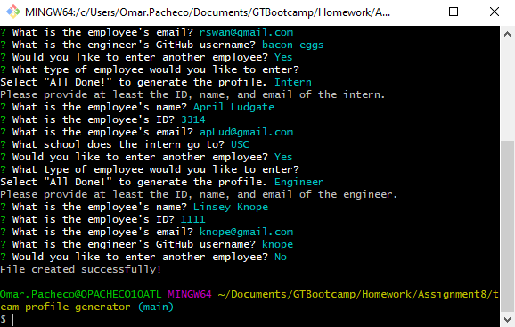

# team-profile-generator
This team profile generator is a command line application that will take user input about their development team and then create a webpage with the information provided.

## What was the point?
The point of this application is to give people working on a development team a quick and easy way to create a dashboard that contains some basic information for each of their team members.\
Along with this, for me personally it served as a great way to practice some JS and work with the <a href="https://www.npmjs.com/package/inquirer">Inquirer</a> node package as well as the <a href="https://jestjs.io/">Jest</a> testing framework.

## Lessons Learned
More familiarity with the inquirer tool and exposure to the <a href="https://jestjs.io/">Jest</a> testing framework.\
Coming from a Java background, it's interesting to see how we deal with instantiating an object in JavaScript and ensuring the data is what you expect.

## Usage Information
Of course! Take a look at the video below which will get you started!\
<a href="https://watch.screencastify.com/v/qSzOX7fzR0o79XxQpA5T">Demo Video</a>

## Installation
Pretty easy for this one, since it's a small app. Once you clone it, just run a git install command in the root folder of the repo and you're all set!

## Improvements
* Adding more employee types
* Storing the data for someone so they can continue to add to the roster
* Ability to remove someone from the roster as well
* More error handling
* More tests
*  Maybe add some slight changes to styling to the various employee cards depending on the employee role

## Screenshots

